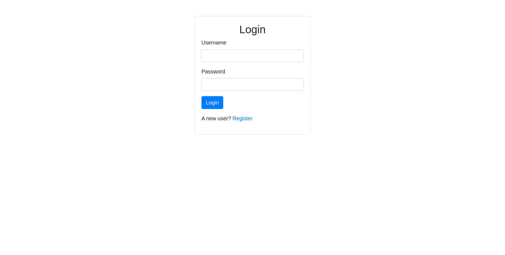

# Diary

Diary is a simple fullstack app.  
Backend side was made using DRF(Django Rest Framework) while the fronted side was made using React.js + Redux libraries

The idea behind the application is to have a dedicated place to store, create new and manage existing diary entries. 

------------------------------------

API Endpoints:
* /api/v1/rest-auth/login - to login user
* /api/v1/rest-auth/user - to get detailed info about current logged in user
* /api/v1/rest-auth/logout - to logout
* /api/v1/rest-auth/registration - to register user
* /api/v1/records - to get all the records of current user (token identifier needed)
* /api/v1/records?page=1 - to get the second page or records, records per page = 12
* /api/v1/records?title&body - we can get only specified fields of record as well
* /api/v1/records/\<int:pk\> - to get detailed info about specified record

------------------------------------

## Fronted screenshots

  
  

At the main/records page I have created an automatic pagination, as long as you scrolling down, more and more records will be loaded  
  

To see full records, just click on it  
  

We can add new record by pressing the "Add" button  
  

Or edit existing  
  

------------------------------------

        To clone this project you need:
            * mkdir diary
            * cd diary
            * git clone https://github.com/kinfi4/MyDiary.git

            * cd backend
            * python3 -m venv env
            * source env/bin/activate
            * pip install -r req
            * python manage.py makemigrations
            * python manage.py migrate
            
            * cd ../frontend
            * npm install

        And you are done ^^

